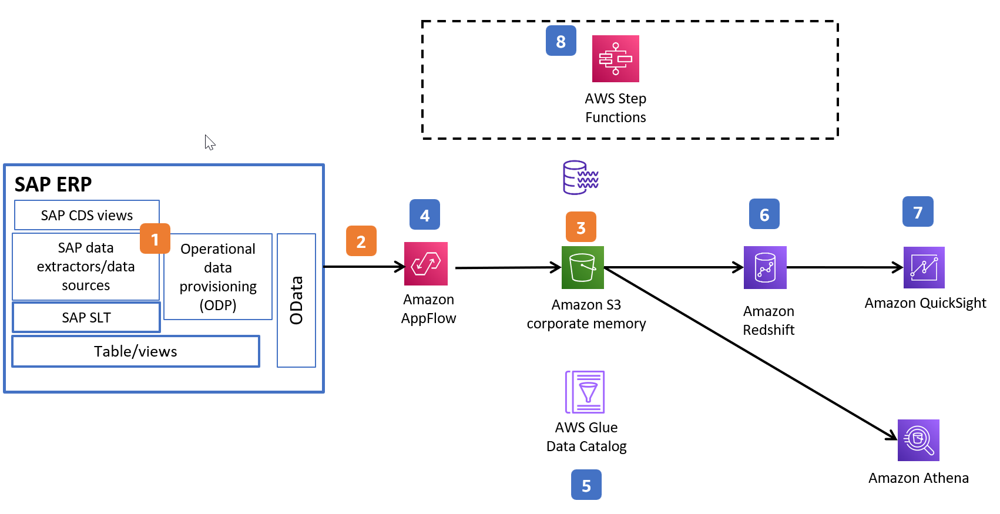
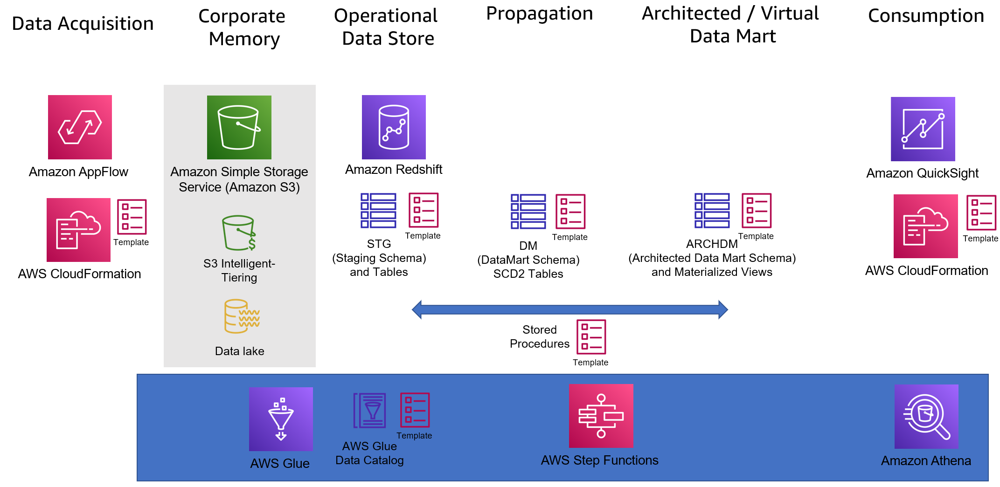

# AWS Analytics Fabric for SAP

AWS Analytics Fabric for SAP has been built to help accelerate SAP customer journeys to AWS Analytics and AI/ML services.  These accelerators can be used as a baseline for development and be modified and customized as required specific to your SAP implementation.  

## Description
Accelerators are provided by business process (for example, order to cash).  Each accelerator includes Cloudformation templates for deployment of S3 buckets, AppFlow flows, Glue Data Catalog entries, and SQL scripts for deployment on Amazon Redshift.

## Architecture

This architecture shows how to build a cloud data warehouse using SAP data on AWS, by extracting data from SAP via the OData protocol. The data warehouse can be used to model and combine your SAP data with that of other sources loaded into your data warehouse.  Data can be consumed by other purpose-built services.

1) Install and activate standard SAP Business Content Extractors. Configure ODP for extraction in the SAP gateway of your SAP system.
2) Create the OData system connection from Amazon AppFlow to your SAP source system.  This can be over PrivateLink for SAP on AWS/connect with AWS via VPN/direct connect, or over the internet.
3) Create an S3 bucket to store data.
4) In Amazon AppFlow, create the Flow using the SAP source created in step 3.  Run the flow to extract data from SAP and save to an S3 bucket.  
5) Create a data catalog entry with metadata for the extracted SAP data in your S3 bucket.
6) Load data into Amazon Redshift through ‘COPY’ commands.  Model the data appropriately, enable the capability for visibility of historical movement of data.
7) Create the dataset in QuickSight with Amazon Redshift as your datasource. Create a dashboard to visualize the business data as per requirements.
8) Orchestrate the end to end process.

### Architecture components of the accelerators
In **data acquisition** we are using an AWS CloudFormation template to deploy, activate and schedule data flows from your SAP system based on standard SAP Business content. \
The data will be extracted into your **S3 bucket**, within an **AWS DataLake**. We also recommend that for your S3 bucket, you have **S3 Intelligent Tiering** defined, to ensure that ‘colder’ corporate memory is appropriately tiered, and you benefit from reduced storage costs. \
From an operational data storage, propagation, and Data Mart perspective, we utilize **Amazon Redshift**. For the configuration we provide you with scripts that will create schemas, and deploy the DDL’s with appropriate structures required to load the SAP source data.  These DDL can easily be enhanced with any SAP source system specific customizations you may have (typical SAP Z custom fields). \
From the delta data being loaded in S3 periodically by the **AppFlow** flows, we are able to generate SCD2 tables (or tables that will contain the entire history of changes). \
Stored Procedures are provided, which, through use of the autoloader feature in Redshift are able to automate the movement within Redshift and generate the appropriate entries.  
Finally, some sample architected data mart models are provided using Materialized Views in Redshift.  This is very comprehensive, and can easily be used as a basis for further data ingestion.\
Finally, another cloudformation template allows you to create datasources, and templates in **Amazon Quicksight** for immediate insight generation. 

## Installation

### Order-To-Cash (OTC)

The Order to cash accelerator utilizes SAP provided standard business content extractors to extract data from your underlying SAP system, just changes, utilizing the SAP built in delta mechanism.

Please refer to [OTC](order-to-cash/README.md) section for further guidance.

## Pre-requisites

If you do not have the mentioned SAP extractors installed/enabled in your SAP system (you can check if they exist in SAP transaction RSA6) you will need to install and activate them via transaction code RSA5 (refer to [Installing Business Content DataSources](https://help.sap.com/docs/SAP_HANA_PLATFORM/3a867e2b61f14795bf39a60bba5bccc9/bc01e6d8bb571014957c9c67683adecb.html?version=2.0.04))

In case your extractors appears empty or have no data you need to run the reconstruction as mentioned here [Sales and Distribution records reconstruction](https://help.sap.com/saphelp_SCM700_ehp02/helpdata/en/04/356f5141e2192be10000000a441470/content.htm?no_cache=true)

These extractors will need to be published as a service via transaction code SEGW. For more information on this refer to: 
- [Exposing SAP BW Extractors via ODP as an OData Service](hhttps://blogs.sap.com/2020/11/02/exposing-sap-bw-extractors-via-odp-as-an-odata-service/)
- [LO extractors activation and extraction in S/4 HANA](https://blogs.sap.com/2017/02/14/lo-extractors-activation-and-extraction-in-s4-hana/)
- [Procedure to Load data using Setup Table](https://blogs.sap.com/2014/09/17/procedure-to-load-data-using-setup-table/)

You will need to create a public or private connection to your SAP source system in Amazon AppFlow OData connector. Please refer to [SAP OData connector for Amazon AppFlow](https://docs.aws.amazon.com/appflow/latest/userguide/sapodata.html) for public connection or to [SAP OData connector for Amazon AppFlow with AWS PrivateLink](https://aws.amazon.com/blogs/awsforsap/share-sap-odata-services-securely-through-aws-privatelink-and-the-amazon-appflow-sap-connector/) for private connection using AWS Private Link.

You will need to create an S3 Bucket for your data to be stored.  You may use an existing bucket.  You will need to define the bucket policy as per the documentation.  This ensures that Amazon Appflow has permissions to write data to your bucket (https://docs.aws.amazon.com/appflow/latest/userguide/s3-policies-management.html)

## Usage
The samples provided will need to be parametrized appropriately based on your SAP system configuration (for example, the AppFlow samples will need to include the mapping to the service name you created).  These samples are designed to accelerate your journey, but can be modified and expanded upon to suit your implementation.  Details of modifications required to scripts are detailed within each script in the documentation at the top.

## Support
For any support or technical questions please contact us on sap-accelerators@amazon.com.

## Roadmap
Additional business processes will be added to this repo over time, based on customer feedback and priorities.